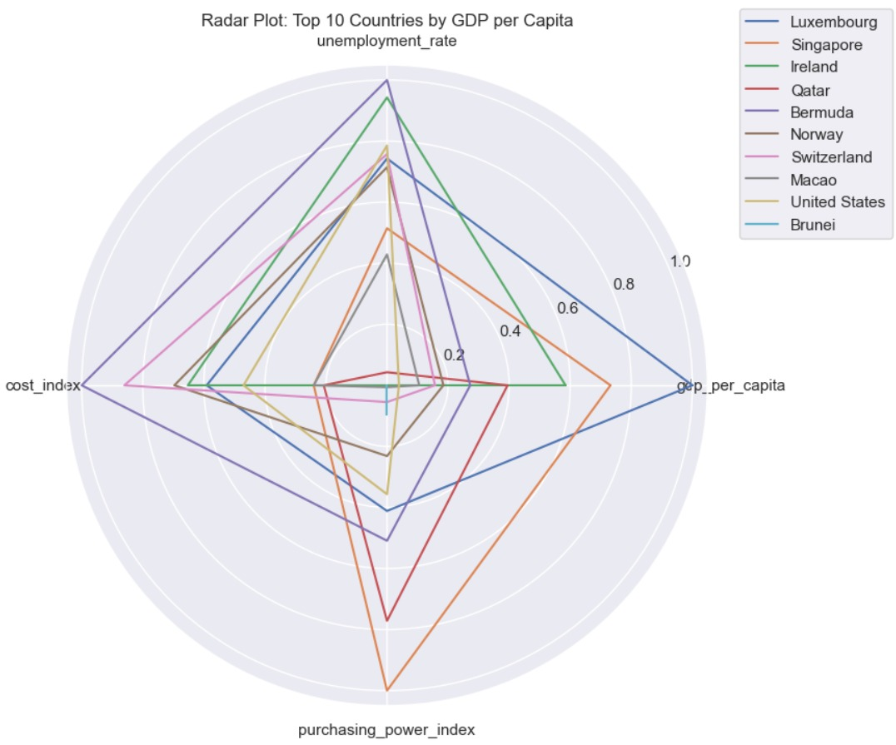

### 🌍 **World Economic Data - Complete Data Analysis**

This project is an end-to-end data analysis of global economic indicators, exploring cost of living, corruption index, and quality of life metrics across countries. The goal is to reveal insights and patterns that help understand the global economic landscape using statistical analysis and data visualization.

---

### 📌 **Project Objectives**

* Analyze and compare economic indicators across countries.
* Correlate the cost of living, rent index, groceries index, and local purchasing power.
* Explore corruption perceptions across nations.
* Use visualizations to detect trends and outliers.
* Build a clean and structured dataset ready for machine learning or BI applications.

---

### 🧠 **Key Insights**

* Countries with high local purchasing power often have lower rent-to-income ratios.
* There’s a noticeable inverse correlation between corruption index and quality of life in certain regions.
* European countries generally show a strong balance between the cost of living and quality of life.

---

### 🛠️ **Tools & Technologies Used**

* **Python** (Pandas, NumPy)
* **Seaborn & Matplotlib** for data visualization
* **Jupyter Notebook** for code development and presentation
* **Correlation Heatmaps**
* **Bar Plots, Line Charts, Distribution Analysis**

---

### 📂 **Project Structure**

* `world-economic-data-complete-data-analysis.ipynb` – Complete analysis notebook
* Cleaned datasets and visualizations
* In-depth comments and function-based code organization

---

### 📊 **Visuals Include**

* Heatmaps for correlations
* Bar plots for cost and quality metrics
* Line plots to show comparative trends by country
* Outlier detection visuals

---

### 🤝 **Collaboration & Feedback**

This project is open for improvement. Suggestions, forks, and contributions are welcome.

📥 If you have feedback or want to share your ideas, feel free to open an issue or submit a pull request!

Email: official.deemis@outlook.com

Thank You
Deepak Mishra

